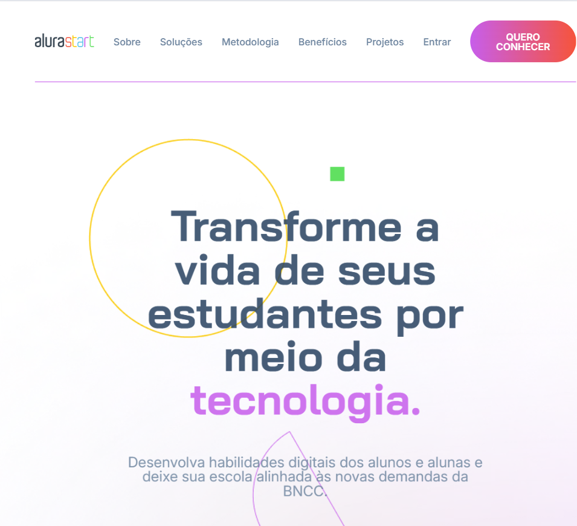
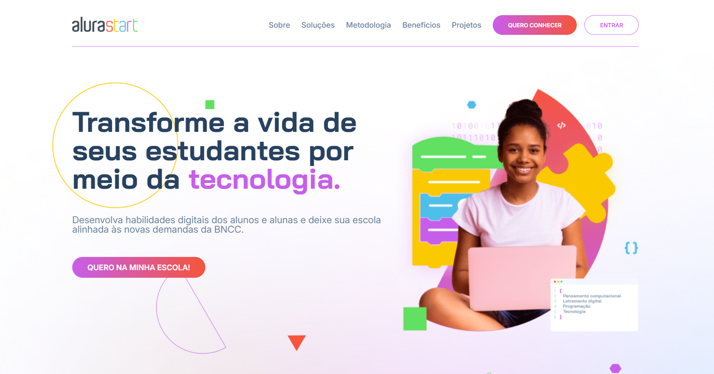

# Alura Start

## ℹ️ Sobre

Projeto utilizado no curso para aprendizado das técnicas e melhores práticas.

## 📘Ementa

### CSS: aplique responsividade usando media queries

- Usar media queries para criar layouts responsivos
- Aplicar técnicas de layout fluido com medidas flexíveis
- Implementar imagens responsivas usando srcset
- Entender como flexbox e grid podem ajudar na construção de layout fluido
- Testar e ajustar a responsividade do layout

## 🖥️ Tecnologias

  
  

## 🧑‍🏫 Instrutor(es)

| [ Neilton Seguins](https://github.com/NeiltonSeguins) |
| :----------------------------------------------------------------------------------------------------------------------------------------------------------: |

## 💻 Screenshot

  
  #### Tablet
  

#### Tablet

  
  
  #### Desktop
  

